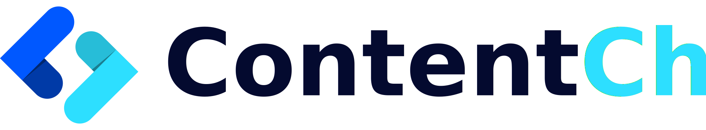

<div align="center">
  
</div>

NextJs Starter for [ContentChef - Headless CMS](https://www.contentchef.io/)
===========================

[ContentChef](https://www.contentchef.io/) is an Headless CMS designed to accelarete the development of modern,cross channel digital products.

This starter is a simple [NextJS](https://nextjs.org/) integrated with our Delivery API using the [ContentChef JS/Typescript SDK](https://github.com/ContentChef/contentchef-node)

In this example plain JS is used, but our SDK is primarly written for **Typescript** applications!

# Requirements

In order to use make this starter work, you will need

* An active ContentChef account (sign up for a 30-day free trial [here](https://www.contentchef.io/registration))
* Node JS >= 10.13

# Clone & Installation

Clone the starter repo and install all the deps

```bash
    git clone git@github.com:ContentChef/nextjs-starter.git
    cd nextjs-starter
    npm install
```

Get your SpaceID, Online API Key from your dashboard home page.


Open `./services/contentChefClient.js` and copy your data in the clinet configuration and use "example-ch" for your channel now.

```javascript
import ContentChefClient, { createUrl } from '@contentchef/contentchef-node';

class ContentChef {
  client;
  targetDate;
  defaultChannel = 'example-ch';
  onlineChannel;

  constructor() {
    this.client = ContentChefClient({
      spaceId: 'your-contentChef-spaceId',
    }, this.targetDate);
    this.onlineChannel = this.client.onlineChannel('your-contentChef-api-key', this.defaultChannel);
  }

}

```

You are now ready to start the nextjs server

```bash
npm run dev
```

Enjoy!

You can now visit [https://localhost:3000/](https://localhost:3000/) and see the list of content fetched from Content Chef!

To Learns More
===========================

* [ContentChef Website](https://wwww.contentchef.io)
* [ContentChef Docs](https://docs.contentchef.io)
* [ContentChef Blog](https://www.contentchef.io/blog)
* [Next.js Documentation](https://nextjs.org/docs) - learn about Next.js features and API.
* [Learn Next.js](https://nextjs.org/learn) - an interactive Next.js tutorial.
